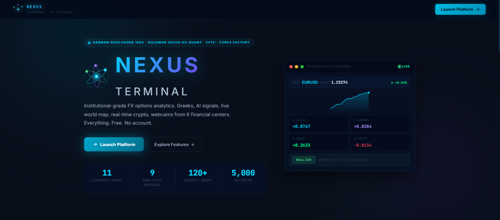
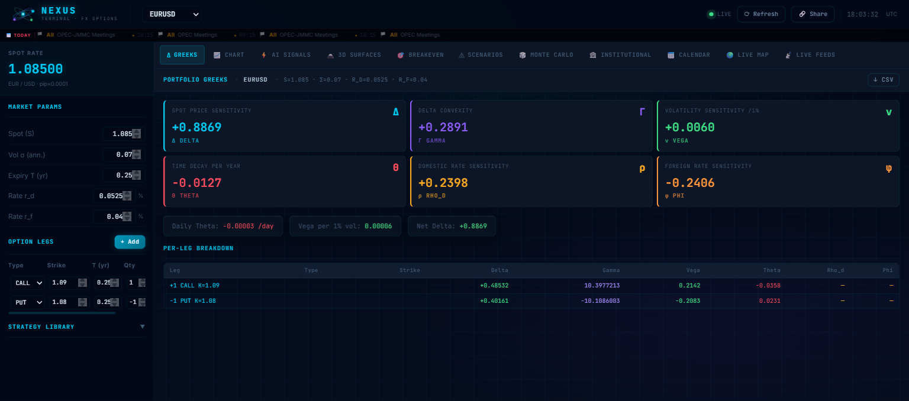
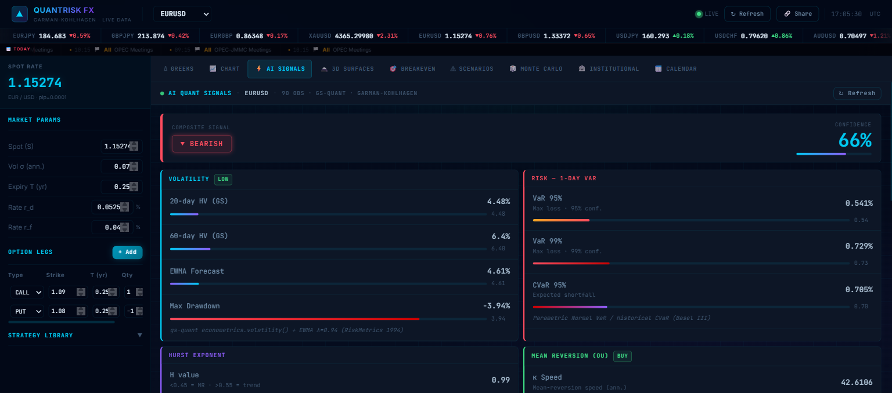
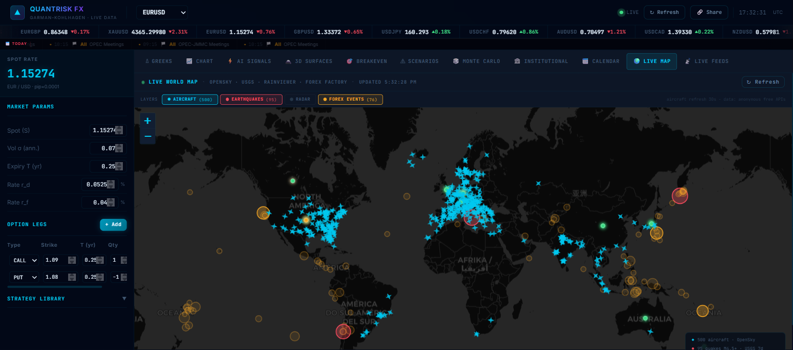
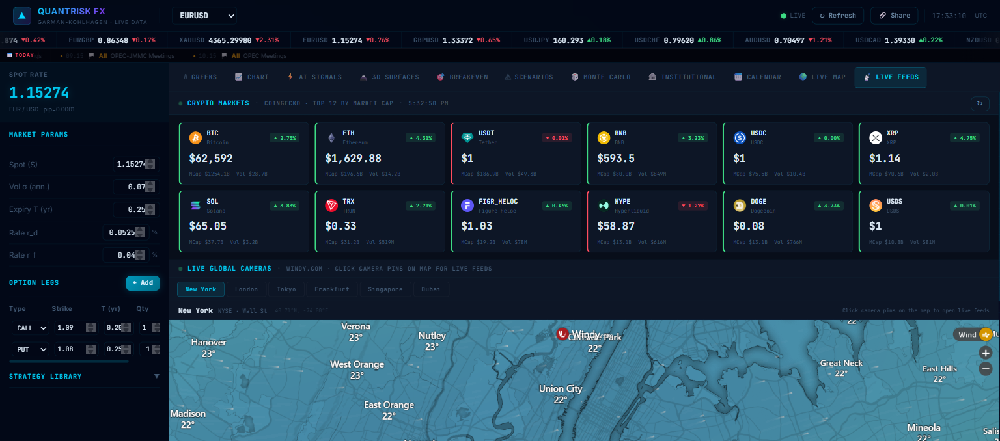
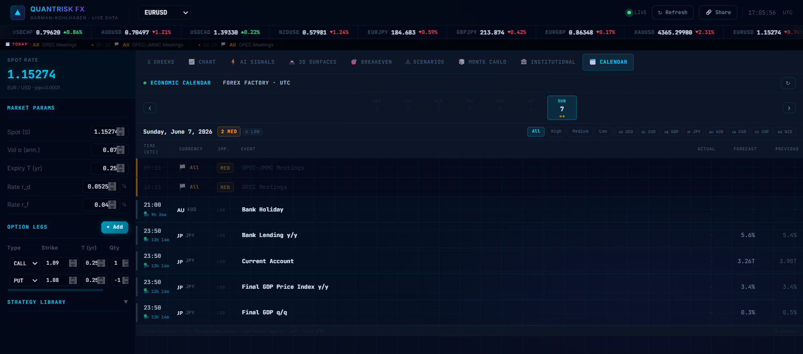

<div align="center">

# ⚛ NEXUS TERMINAL

### Institutional-Grade FX Options Analytics Platform

[](https://python.org)
[](https://fastapi.tiangolo.com)
[](https://react.dev)
[](https://vitejs.dev)
[](LICENSE)

*Three orbital rings. One terminal. Every market.*



</div>

---

## What is NEXUS?

NEXUS TERMINAL is a Bloomberg-style web application for professional forex options analysis. It combines **Garman-Kohlhagen options pricing**, **Goldman Sachs gs-quant signals**, **live global data feeds**, and a **real-time world map** — all in one free, no-account-required platform.



---

## Features

### Options Analytics
| Module | Description |
|--------|-------------|
| **Greeks Dashboard** | Δ Delta · Γ Gamma · ν Vega · Θ Theta · ρ Rho · φ Phi — per leg and portfolio total via Garman-Kohlhagen (1983) |
| **Volatility Surfaces** | Interactive 3D surface plots (Delta, Gamma, Vega, Theta, P&L) across full spot × vol grid |
| **Breakeven Profile** | Payoff curve at expiry with breakeven strikes, max profit/loss, net premium |
| **Scenario Analysis** | Stress tests across spot ±5%/±10% and vol ±1pp/±2pp shocks |
| **Monte Carlo** | GBM path simulation — up to 5,000 paths, terminal P&L distribution, probability of profit |
| **Strategy Library** | Pre-built multi-leg strategies: straddle, strangle, bull/bear spreads, iron condor, butterfly |

### Live Intelligence



| Module | Description |
|--------|-------------|
| **AI Quant Signals** | 9 signals: RSI, MACD, Bollinger Bands, Hurst exponent, mean reversion (OU), momentum, carry, volatility regime — powered by gs-quant |
| **Institutional Flow** | CFTC COT positioning — Asset Managers, Hedge Funds, Dealers — with Volume Profile, POC, VAH, VAL |
| **Economic Calendar** | Forex Factory events (120+ per week) with impact levels, forecasts, countdowns, and currency filters |

### Live World Map



| Layer | Source | Refresh |
|-------|--------|---------|
| ✈ Aircraft positions | OpenSky Network (free, anonymous) | 30s |
| 🔴 Earthquake markers | USGS GeoJSON feed (M4.5+, 7 days) | 5min |
| 🌦 Weather radar | RainViewer animated tiles | on-demand |
| 📍 Forex events | Forex Factory via backend cache | with calendar |

### Live Feeds



- **Crypto prices** — Top 12 by market cap via CoinGecko free API, 60s refresh
- **Global webcams** — Windy.com live camera feeds for 6 financial centers: New York · London · Tokyo · Frankfurt · Singapore · Dubai

### Economic Calendar



---

## Tech Stack

```
NEXUS TERMINAL
├── backend/                  FastAPI (Python 3.11+)
│   └── app/
│       ├── core/             Garman-Kohlhagen · Greeks · Monte Carlo · Quant Analysis
│       └── routers/          REST API endpoints
│           ├── greeks.py     Options pricing & Greeks
│           ├── surface.py    Volatility surface grid
│           ├── montecarlo.py GBM simulation
│           ├── scenarios.py  Stress testing
│           ├── forex.py      Live FX rates
│           ├── institutional.py  CFTC COT data
│           ├── news.py       Forex Factory calendar
│           └── livedata.py   Aircraft & earthquake proxy
│
└── frontend/                 React 18 + Vite 5
    └── src/
        ├── components/
        │   ├── GreeksDashboard.jsx
        │   ├── QuantSignals.jsx    (gs-quant AI signals)
        │   ├── WorldMap.jsx        (Leaflet + live layers)
        │   ├── LiveFeeds.jsx       (Crypto + Webcams)
        │   ├── EconomicCalendar.jsx
        │   ├── InstitutionalFlow.jsx
        │   └── NexusLogo.jsx       (animated SVG + canvas favicon)
        └── pages/
            ├── LandingPage.jsx
            └── Dashboard.jsx
```

### Key Libraries

**Backend**
- `fastapi` — REST API framework
- `gs-quant` — Goldman Sachs quant library (RSI, MACD, Bollinger, volatility)
- `numpy` / `scipy` — Monte Carlo, OU process, Hurst exponent
- `httpx` — Async HTTP client for proxying live data

**Frontend**
- `react-leaflet` + `leaflet` — Interactive world map with live layers
- `plotly.js` — 3D volatility surface plots
- `zustand` — Global portfolio state management
- `JetBrains Mono` — Bloomberg-terminal monospace font

---

## Getting Started

### Prerequisites
- Python 3.11+
- Node.js 18+

### Backend

```bash
cd backend
python -m venv .venv

# Windows
.venv\Scripts\activate
# macOS/Linux
source .venv/bin/activate

pip install -r requirements.txt
uvicorn app.main:app --reload --port 8000
```

API available at `http://localhost:8000` · Docs at `http://localhost:8000/docs`

### Frontend

```bash
cd frontend
npm install
npm run dev
```

App available at `http://localhost:5173`

---

## API Endpoints

| Method | Endpoint | Description |
|--------|----------|-------------|
| `POST` | `/api/greeks` | Compute portfolio Greeks (Garman-Kohlhagen) |
| `POST` | `/api/surface` | Generate volatility surface grid |
| `POST` | `/api/montecarlo` | Run GBM Monte Carlo simulation |
| `POST` | `/api/scenarios` | Stress-test scenario matrix |
| `GET`  | `/api/forex/rates` | Live FX spot rates |
| `GET`  | `/api/news/calendar` | Forex Factory economic calendar |
| `GET`  | `/api/institutional/{pair}` | CFTC COT positioning data |
| `GET`  | `/api/signals/{pair}` | AI quant signals (gs-quant) |
| `GET`  | `/api/live/aircraft` | Live aircraft positions (OpenSky proxy) |
| `GET`  | `/api/live/earthquakes` | USGS earthquake feed proxy |

---

## Design System

NEXUS uses a Bloomberg terminal-inspired design:
- **Colors** — Navy dark (`#080e1a`) base, cyan (`#00c8f0`) accent, semantic red/green/amber/purple
- **Typography** — JetBrains Mono for all data panels, `tabular-nums` for price columns
- **Panels** — 3px left-border accent system (worldmonitor-style)
- **Tokens** — `color-mix(in srgb, ...)` for semi-transparent semantic backgrounds

---

## Data Sources

| Source | Data | Cost |
|--------|------|------|
| Goldman Sachs gs-quant | RSI, MACD, Bollinger, volatility | Free (open-source) |
| OpenSky Network | Live aircraft positions | Free, anonymous |
| USGS Earthquake API | M4.5+ seismic events | Free |
| RainViewer | Weather radar tiles | Free |
| Forex Factory | Economic calendar (120+ events/week) | Free |
| CoinGecko | Crypto prices (top 12) | Free |
| Windy.com | Global webcam feeds | Free embed |
| Yahoo Finance (via yfinance) | FX historical rates | Free |

---

## License

MIT © 2026 — Built with ⚛ NEXUS TERMINAL
